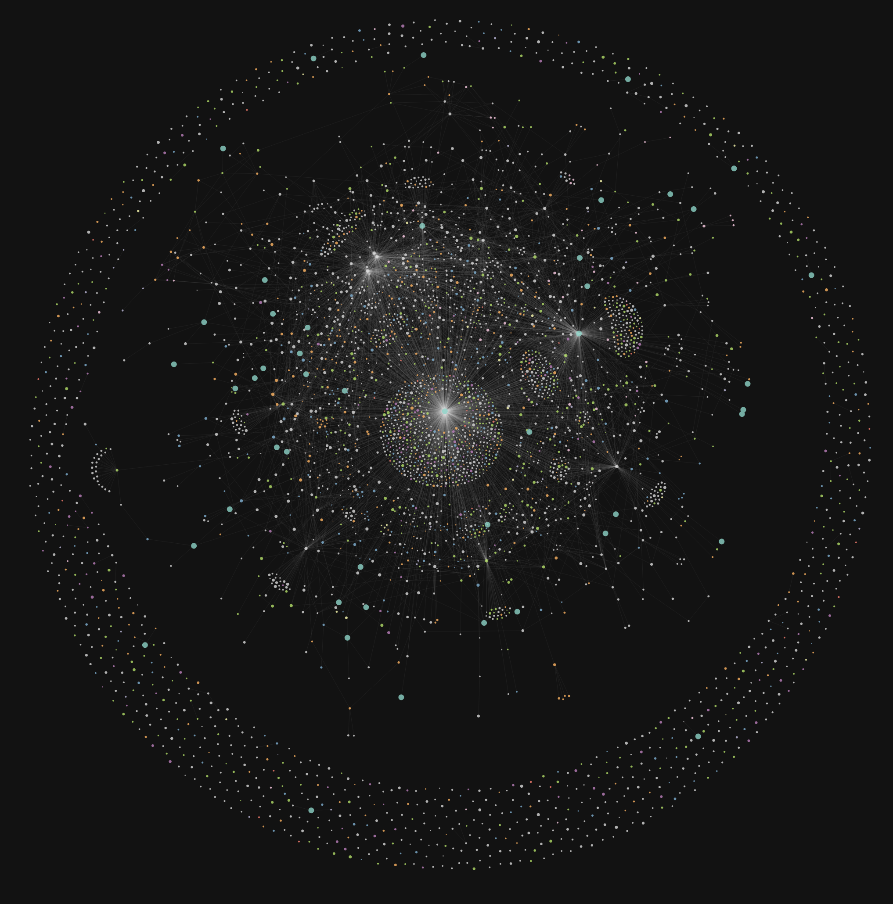

# Milkypostman’s Emacs Lisp Package Archive Visualization
Visualizes MELPA as a force directed graph with D3.



## Instructions
Download the necessary data files from `melpa.org/archive.json` and `melpa.org/download_counts.json` into the `dist` folder. Then, run

```
npm install
npm run build
npm start
```

to start the webserver. The site should be accessible at `localhost:8080`.
